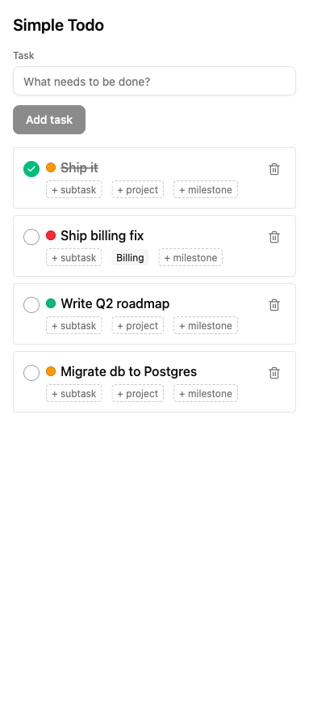

# simpletodo

A right-edge sidebar todo app, built to be embedded alongside another page (e.g., a browser extension panel).

Live: https://simpletodo-1776350919.netlify.app



## Stack

Bun + React 19 + TypeScript + Tailwind v4 + shadcn/ui.

## Dev

```bash
bun install
bun dev
```

Dev server runs at http://localhost:3000/ with HMR.

## Build

```bash
bun run build
```

Outputs a static site to `dist/`.
